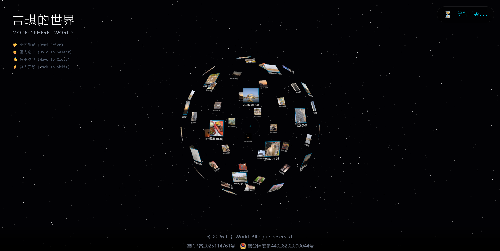

# 🌌 JiQi-World (吉琪的世界)

> **"Give your memories a dimension. A cyberpunk 3D gallery controlled by your hands."**
> 
> 一个融合了 **React + Three.js + MediaPipe + Gyroscope** 的沉浸式 3D 纪念相册。不仅是视觉盛宴，更是一次打破次元壁的交互实验。




## ✨ 核心亮点 (Highlights)

### 1. 🖐️ 隔空手势交互 (AI Gesture Control)
无需鼠标，无需触摸。利用 **MediaPipe** 视觉算法，通过摄像头捕捉你的手势：
- **Open Palm (张开手掌)**：全向浏览 (Omni-Drive)，控制地球 360° 自由旋转。
- **Fist (握拳)**：蓄力选中 (Hold to Select)，锁定目标并查看记忆详情。
- **Wave (挥手)**：挥手退出 (Wave to Close)，快速关闭详情面板。
- **Rock (摇滚手势)**：蓄力变形 (Rock to Shift)，在球体模式与 DNA 螺旋模式间无缝切换。

### 2. 📱 口袋宇宙 (Pocket Universe)
在移动端，利用 **DeviceOrientation (陀螺仪)** 技术，将手机化身为全息探测器：
- **体感操控**：转动身体，手机屏幕里的 3D 宇宙随之旋转。
- **沉浸体验**：抬手看星空，低头看深渊，仿佛置身于记忆的银河中心。

### 3. 🎨 极致视觉与性能 (Visuals & Performance)
- **Zero GC Optimization**：核心渲染循环零垃圾回收，确保 60FPS 丝滑运行。
- **Cyberpunk Style**：黑金配色，呼吸光效，HUD 战术面板风格。
- **Responsive Design**：PC 端硬核 3D，移动端优雅列表 + 3D 彩蛋双模式。

## 🛠️ 技术栈 (Tech Stack)

- **Core**: [React 18](https://reactjs.org/) + [Vite](https://vitejs.dev/)
- **3D Engine**: [Three.js](https://threejs.org/) + [@react-three/fiber](https://docs.pmnd.rs/react-three-fiber)
- **AI/Vision**: [MediaPipe Hands](https://google.github.io/mediapipe/solutions/hands) + [TensorFlow.js](https://www.tensorflow.org/js)
- **Styling**: [Tailwind CSS](https://tailwindcss.com/) + [Framer Motion](https://www.framer.com/motion/)
- **Backend**: [Supabase](https://supabase.com/) (PostgreSQL + Storage)

## 🚀 快速开始 (Quick Start)

想要部署一个属于你自己的 3D 世界？

### 1. 克隆项目
```bash
git clone https://github.com/your-username/JiQi-World.git
cd JiQi-World
npm install
```

### 2. 配置数据库 (Supabase)
1. 在 [Supabase](https://supabase.com/) 创建一个新项目。
2. 创建表 `memories`，字段如下：
   - `id` (uuid, primary key)
   - `image_url` (text)
   - `description` (text)
   - `memory_date` (date)
3. 创建 Storage Bucket `photos` 并设置为公开。
4. 获取你的 `SUPABASE_URL` 和 `SUPABASE_ANON_KEY`。

### 3. 环境变量
在项目根目录创建 `.env` 文件：
```env
VITE_SUPABASE_URL=your_supabase_url
VITE_SUPABASE_ANON_KEY=your_supabase_anon_key
```

### 4. 个性化配置 (Customization)
只需修改 `src/config.js` 文件，即可将网站标题改成你们的名字：
```javascript
export const config = {
  title: "吉琪的世界", // 改成你的标题，如 "小明和小红的宇宙"
  // ... 其他配置
};
```

### 5. 启动
```bash
npm run dev
```

## 🎮 操作指南

| 手势/操作 | 功能 | 备注 |
| :--- | :--- | :--- |
| **张开手掌 (🖐)** | 全向浏览 | 控制地球旋转与缩放 |
| **握拳 (✊)** | 蓄力选中 | 进度条满后自动进入详情 |
| **左右挥手 (👋)** | 挥手退出 | 快速返回主视图 |
| **摇滚手势 (🤘)** | 蓄力变形 | 切换球体/螺旋布局 |
| **手机转动** | 视角同步 | 移动端专用感应模式 |

## 📜 License

MIT License © 2026[guojiaji]

---

*Made with ❤️ for JiQi.*
